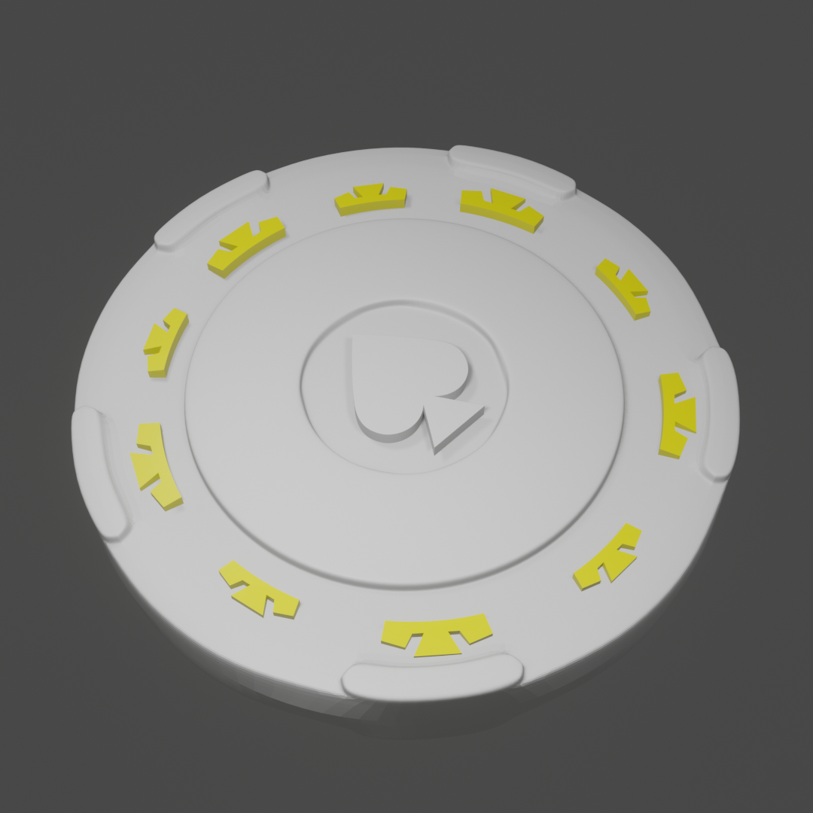
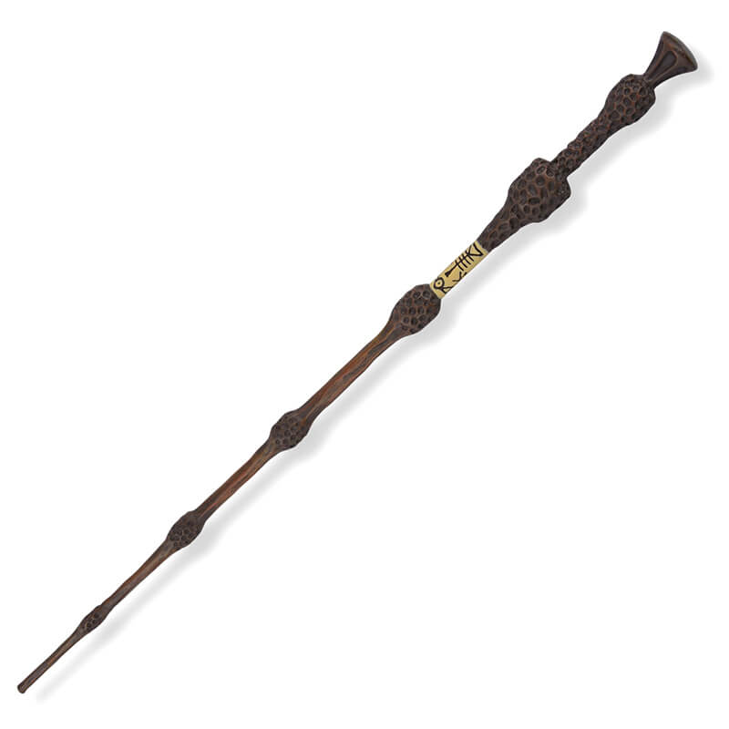

# 3D Objects

Dans ce dépôt GitHub, vous retrouverez tous les objets ainsi que les images.

## Structure du dépôt

Chaque dossier contient un fichier `.blend` qui est le fichier source de l'objet 3D. Chaque dossier est un projet a part entiere.
Il contient :

- `model.blend` le fichier sources de l'objets
- `ref` des reférences utilisée
- un dossier `render` contenant les différents rendu fait que cela soit des videos ou des images
- un dossier `assets`contenant les textures et les images utilisées
- un fichier `Task.md` qui contient les taches a faire pour le projet

## Utilisation

Pour utiliser ces objets 3D, clonez ce dépôt et importez les fichiers `.fbx` dans votre logiciel 3D préféré.
Ou meme vous pouvez utilisez les .blend avec blender.

## Contribution

Si vous souhaitez contribuer à ce dépôt, n'hésitez pas à faire un pull request. Toutes les contributions sont les bienvenues !

## Licence

Ce projet est sous licence MIT. Voir le fichier `LICENSE` pour plus de détails.

## Les projets et leur avancement
 ### .git : 

- [.git](./.git/Task.md) : 
  - [Assets](./.git/assets/)
  - [References](./.git/ref/)
  - [Rendu](./.git/render/)

 ### 3D_Builder : 

- [3D_Builder](./3D_Builder/Task.md) : 
  - [Assets](./3D_Builder/assets/)
  - [References](./3D_Builder/ref/)
  - [Rendu](./3D_Builder/render/)

 ### AnimationAssoTeck : 

- [AnimationAssoTeck](./AnimationAssoTeck/Task.md) : 
  - [Assets](./AnimationAssoTeck/assets/)
  - [References](./AnimationAssoTeck/ref/)
    - 
  - [Rendu](./AnimationAssoTeck/render/)

 ### Assets : 

- [Assets](./Assets/Task.md) : 
  - [Assets](./Assets/assets/)
  - [References](./Assets/ref/)
  - [Rendu](./Assets/render/)

 ### BaniereEfrei3D : 

- [BaniereEfrei3D](./BaniereEfrei3D/Task.md) : 
  - [Assets](./BaniereEfrei3D/assets/)
  - [References](./BaniereEfrei3D/ref/)
  - [Rendu](./BaniereEfrei3D/render/)
    - 
    - 
    - 
    - 

 ### BarbieScene : 

- [BarbieScene](./BarbieScene/Task.md) : 
  - [Assets](./BarbieScene/assets/)
  - [References](./BarbieScene/ref/)
    - 
  - [Rendu](./BarbieScene/render/)
    - 

 ### BleuBague : 

- [BleuBague](./BleuBague/Task.md) : 
  - [Assets](./BleuBague/assets/)
  - [References](./BleuBague/ref/)
    - 
  - [Rendu](./BleuBague/render/)
    - 
    - 

 ### BreakClock : 

- [BreakClock](./BreakClock/Task.md) : 
  - [Assets](./BreakClock/assets/)
  - [References](./BreakClock/ref/)
    - 
  - [Rendu](./BreakClock/render/)
    - 

 ### ColierPierre : 

- [ColierPierre](./ColierPierre/Task.md) : 
  - [Assets](./ColierPierre/assets/)
  - [References](./ColierPierre/ref/)
    - 
  - [Rendu](./ColierPierre/render/)
    - 

 ### CollierAnge : 

- [CollierAnge](./CollierAnge/Task.md) : 
  - [Assets](./CollierAnge/assets/)
  - [References](./CollierAnge/ref/)
  - [Rendu](./CollierAnge/render/)
    - 

 ### Crane : 

- [Crane](./Crane/Task.md) : 
  - [Assets](./Crane/assets/)
  - [References](./Crane/ref/)
  - [Rendu](./Crane/render/)
    - 

 ### DebarquementNormandieJeu : 

- [DebarquementNormandieJeu](./DebarquementNormandieJeu/Task.md) : 
  - [Assets](./DebarquementNormandieJeu/assets/)
  - [References](./DebarquementNormandieJeu/ref/)
  - [Rendu](./DebarquementNormandieJeu/render/)
    - 

 ### dinosaures : 

- [dinosaures](./dinosaures/Task.md) : 
  - [Assets](./dinosaures/assets/)
  - [References](./dinosaures/ref/)
  - [Rendu](./dinosaures/render/)
    - 
    - 
    - 
    - 
    - 
    - 
    - 
    - 
    - 
    - 

 ### Forest : 

- [Forest](./Forest/Task.md) : 
  - [Assets](./Forest/assets/)
  - [References](./Forest/ref/)
    - 
  - [Rendu](./Forest/render/)
    - 
    - 

 ### HeadRobot : 

- [HeadRobot](./HeadRobot/Task.md) : 
  - [Assets](./HeadRobot/assets/)
  - [References](./HeadRobot/ref/)
  - [Rendu](./HeadRobot/render/)
    - 

 ### HeartAnimation : 

- [HeartAnimation](./HeartAnimation/Task.md) : 
  - [Assets](./HeartAnimation/assets/)
  - [References](./HeartAnimation/ref/)
    - 
    - 
  - [Rendu](./HeartAnimation/render/)

 ### HoldingTree : 

- [HoldingTree](./HoldingTree/Task.md) : 
  - [Assets](./HoldingTree/assets/)
  - [References](./HoldingTree/ref/)
  - [Rendu](./HoldingTree/render/)
    - 

 ### IRV : 

- [IRV](./IRV/Task.md) : 
  - [Assets](./IRV/assets/)
  - [References](./IRV/ref/)
  - [Rendu](./IRV/render/)

 ### LandScape : 

- [LandScape](./LandScape/Task.md) : 
  - [Assets](./LandScape/assets/)
  - [References](./LandScape/ref/)
  - [Rendu](./LandScape/render/)
    - 
    - 

 ### MarcheurDespace : 

- [MarcheurDespace](./MarcheurDespace/Task.md) : 
  - [Assets](./MarcheurDespace/assets/)
  - [References](./MarcheurDespace/ref/)
    - 
    - 
    - 
  - [Rendu](./MarcheurDespace/render/)
    - 

 ### Matrix : 

- [Matrix](./Matrix/Task.md) : 
  - [Assets](./Matrix/assets/)
  - [References](./Matrix/ref/)
  - [Rendu](./Matrix/render/)
    - 

 ### MedivalChurch : 

- [MedivalChurch](./MedivalChurch/Task.md) : 
  - [Assets](./MedivalChurch/assets/)
  - [References](./MedivalChurch/ref/)
  - [Rendu](./MedivalChurch/render/)
    - 

 ### NewYorkStreet : 

- [NewYorkStreet](./NewYorkStreet/Task.md) : 
  - [Assets](./NewYorkStreet/assets/)
  - [References](./NewYorkStreet/ref/)
    - 
    - 
  - [Rendu](./NewYorkStreet/render/)
    - 

 ### PainSentence : 

- [PainSentence](./PainSentence/Task.md) : 
  - [Assets](./PainSentence/assets/)
  - [References](./PainSentence/ref/)
  - [Rendu](./PainSentence/render/)
    - 

 ### PendentifEpee : 

- [PendentifEpee](./PendentifEpee/Task.md) : 
  - [Assets](./PendentifEpee/assets/)
  - [References](./PendentifEpee/ref/)
    - 
  - [Rendu](./PendentifEpee/render/)
    - 

 ### Poker : 

- [Poker](./Poker/Task.md) : 
  - [Assets](./Poker/assets/)
  - [References](./Poker/ref/)
  - [Rendu](./Poker/render/)
    - 

 ### PontonOcean : 

- [PontonOcean](./PontonOcean/Task.md) : 
  - [Assets](./PontonOcean/assets/)
  - [References](./PontonOcean/ref/)
  - [Rendu](./PontonOcean/render/)
    - 

 ### Relique_de_la_mort : 

- [Relique_de_la_mort](./Relique_de_la_mort/Task.md) : 
  - [Assets](./Relique_de_la_mort/assets/)
  - [References](./Relique_de_la_mort/ref/)
    - 
  - [Rendu](./Relique_de_la_mort/render/)
    - 

 ### ricebowl : 

- [ricebowl](./ricebowl/Task.md) : 
  - [Assets](./ricebowl/assets/)
  - [References](./ricebowl/ref/)
  - [Rendu](./ricebowl/render/)
    - 

 ### SalleBainBLR : 

- [SalleBainBLR](./SalleBainBLR/Task.md) : 
  - [Assets](./SalleBainBLR/assets/)
  - [References](./SalleBainBLR/ref/)
  - [Rendu](./SalleBainBLR/render/)
    - 

 ### Telecharger : 

- [Telecharger](./Telecharger/Task.md) : 
  - [Assets](./Telecharger/assets/)
  - [References](./Telecharger/ref/)
  - [Rendu](./Telecharger/render/)

 ### VaiseauScientif : 

- [VaiseauScientif](./VaiseauScientif/Task.md) : 
  - [Assets](./VaiseauScientif/assets/)
  - [References](./VaiseauScientif/ref/)
    - 
  - [Rendu](./VaiseauScientif/render/)
    - 

 ### vda : 

- [vda](./vda/Task.md) : 
  - [Assets](./vda/assets/)
  - [References](./vda/ref/)
  - [Rendu](./vda/render/)

 ### Video : 

- [Video](./Video/Task.md) : 
  - [Assets](./Video/assets/)
  - [References](./Video/ref/)
  - [Rendu](./Video/render/)

 ### VideoInsta : 

- [VideoInsta](./VideoInsta/Task.md) : 
  - [Assets](./VideoInsta/assets/)
  - [References](./VideoInsta/ref/)
  - [Rendu](./VideoInsta/render/)
    - 
    - 

 ### YodaSpeach : 

- [YodaSpeach](./YodaSpeach/Task.md) : 
  - [Assets](./YodaSpeach/assets/)
  - [References](./YodaSpeach/ref/)
  - [Rendu](./YodaSpeach/render/)
    - 

-- Fin des projets
